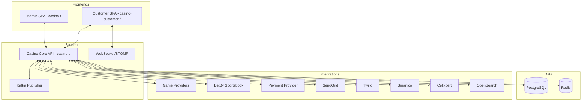

# C4 Container - Casino Platform

```mermaid
flowchart TB
  subgraph Frontends
    AdminUI[Admin SPA - casino-f]
    CustomerUI[Customer SPA - casino-customer-f]
  end

  subgraph Backend
    API[Casino Core API - casino-b]
    WS[WebSocket/STOMP]
    KafkaPub[Kafka Publisher]
  end

  subgraph Data
    Postgres[(PostgreSQL)]
    Redis[(Redis)]
  end

  subgraph Integrations
    GameProvider[Game Providers]
    BetBy[BetBy Sportsbook]
    Payment[Payment Provider]
    SendGrid[SendGrid]
    Twilio[Twilio]
    Smartico[Smartico]
    Cellxpert[Cellxpert]
    OpenSearch[OpenSearch]
  end

  AdminUI <--> API
  CustomerUI <--> API
  CustomerUI <--> WS

  API <--> Postgres
  API <--> Redis
  API <--> KafkaPub

  API <--> GameProvider
  API <--> BetBy
  API <--> Payment
  API <--> SendGrid
  API <--> Twilio
  API <--> Smartico
  API <--> Cellxpert
  API <--> OpenSearch
```
