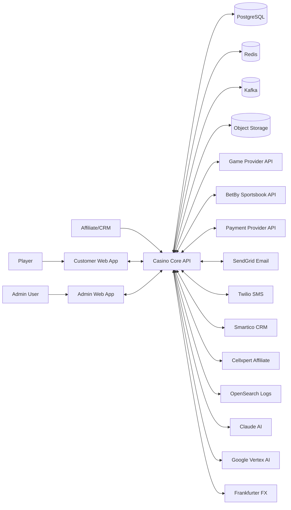

# C4 Context - Casino Platform

The platform serves players and administrators, integrating with external providers.

```mermaid
flowchart LR
  Player[Player] --> CustomerUI[Customer Web App]
  Admin[Admin User] --> AdminUI[Admin Web App]
  Affiliate[Affiliate/CRM] --> Backend[Casino Core API]

  CustomerUI <--> Backend
  AdminUI <--> Backend

  Backend <--> Postgres[(PostgreSQL)]
  Backend <--> Redis[(Redis)]
  Backend <--> Kafka[(Kafka)]
  Backend <--> ObjectStore[(Object Storage)]

  Backend <--> GameProvider[Game Provider API]
  Backend <--> BetBy[BetBy Sportsbook API]
  Backend <--> Payment[Payment Provider API]
  Backend <--> SendGrid[SendGrid Email]
  Backend <--> Twilio[Twilio SMS]
  Backend <--> Smartico[Smartico CRM]
  Backend <--> Cellxpert[Cellxpert Affiliate]
  Backend <--> OpenSearch[OpenSearch Logs]
  Backend <--> Claude[Claude AI]
  Backend <--> Vertex[Google Vertex AI]
  Backend <--> FX[Frankfurter FX]
```
