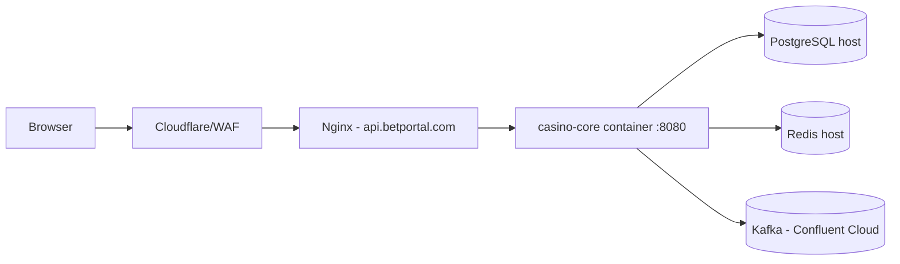

# C4 Deployment - Casino Platform

Based on infra/ production configs (see infra/docker-compose.production.yml and infra/nginx-api.betportal.com.conf).

Notes:
- Backend is published on loopback and proxied via Nginx.
- Redis and PostgreSQL are local to the host.
- Kafka uses Confluent Cloud in application.yml.
