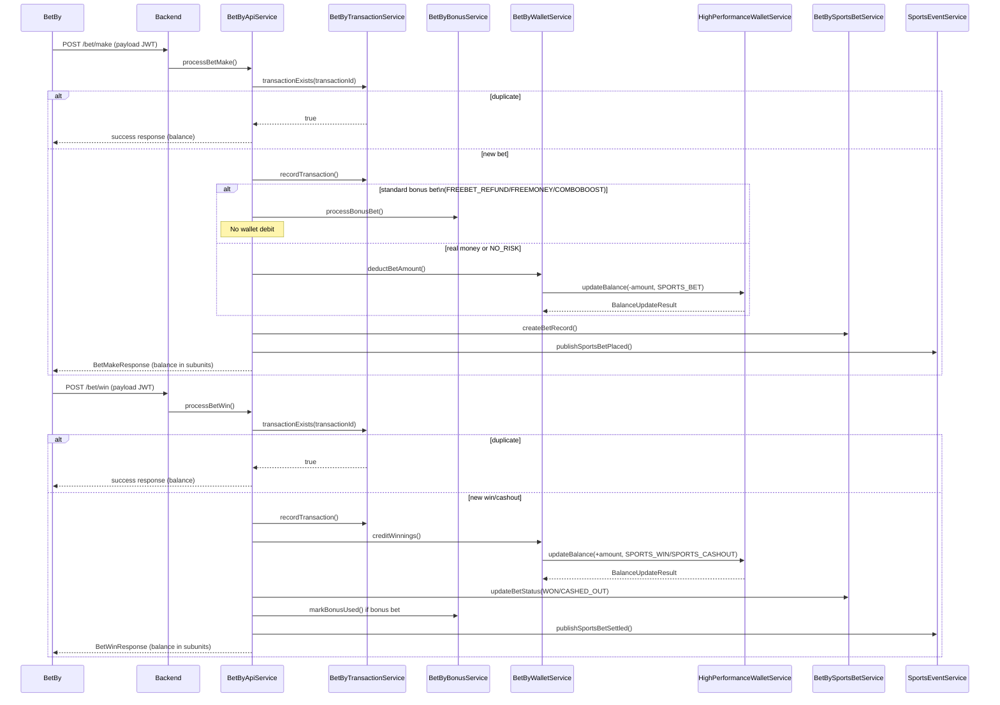
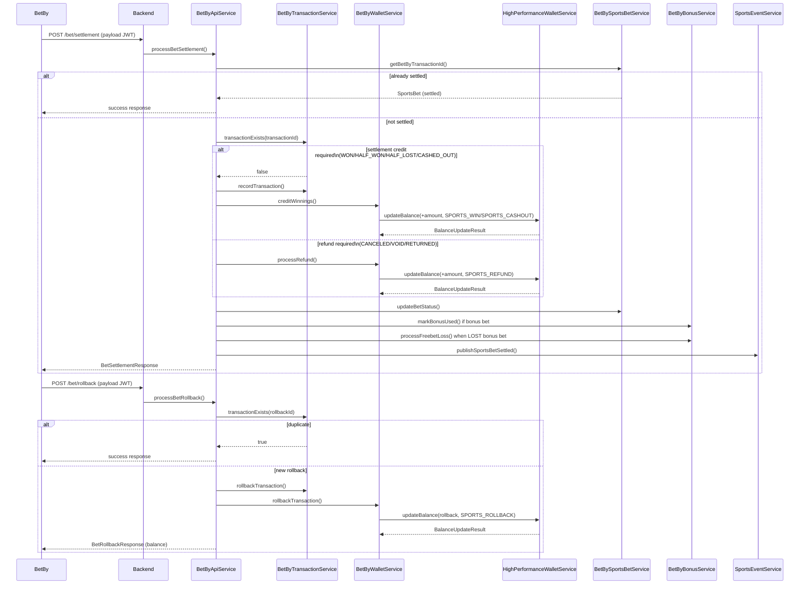

# BetBy Sports Betting Integration (Code-Derived)

This document covers the BetBy sportsbook integration in `casino-b`. It includes inbound BetBy API callbacks, wallet operations, and outbound External API calls.

## Source Files

Inbound BetBy API:
- `casino-b/src/main/kotlin/com/casino/core/sports/controller/BetByController.kt`
- `casino-b/src/main/kotlin/com/casino/core/sports/service/BetByApiService.kt`
- `casino-b/src/main/kotlin/com/casino/core/sports/validation/BetByRequestValidator.kt`
- `casino-b/src/main/kotlin/com/casino/core/sports/dto/request/*`
- `casino-b/src/main/kotlin/com/casino/core/sports/dto/response/*`

Wallet and transaction logic:
- `casino-b/src/main/kotlin/com/casino/core/sports/service/BetByWalletService.kt`
- `casino-b/src/main/kotlin/com/casino/core/sports/service/BetByTransactionService.kt`
- `casino-b/src/main/kotlin/com/casino/core/sports/service/BetBySportsBetService.kt`

JWT and crypto:
- `casino-b/src/main/kotlin/com/casino/core/sports/service/BetByJwtService.kt`
- `casino-b/src/main/kotlin/com/casino/core/sports/service/BetByPartnerJwtService.kt`

External API:
- `casino-b/src/main/kotlin/com/casino/core/sports/client/BetByExternalApiClient.kt`
- `casino-b/src/main/kotlin/com/casino/core/sports/service/BetByExternalApiIntegrationService.kt`
- `casino-b/src/main/kotlin/com/casino/core/sports/config/BetByExternalApiResilienceConfig.kt`

## Inbound BetBy API (Webhook-Style)

Base path: `/api/v1/sport/betby`

Endpoints (each accepts `{ "payload": "<jwt>" }`):
- `GET /ping` -> returns `{"timestamp": <unix>}`
- `POST /bet/make` and `/bet_make` -> BET_MAKE
- `POST /bet/win` and `/bet_win` -> BET_WIN
- `POST /bet/lost` and `/bet_lost` -> BET_LOST
- `POST /bet/refund` and `/bet_refund` -> BET_REFUND
- `POST /bet/discard` and `/bet_discard` -> BET_DISCARD
- `POST /bet/rollback` and `/bet_rollback` -> BET_ROLLBACK
- `POST /bet/commit` and `/bet_commit` -> BET_COMMIT
- `POST /bet/settlement` and `/bet_settlement` -> BET_SETTLEMENT
- `POST /player-segment` and `/player_segment` -> PLAYER_SEGMENT
- `POST /status` -> STATUS

### JWT Verification and Payload Parsing

Incoming requests contain a signed JWT string in `payload` (not encrypted). `BetByJwtService`:
- Private key loaded from `betby.private-key-path` (EC PEM, PKCS8 or EC PRIVATE KEY).
- ES256 tokens are verified using the loaded EC private key.
- RS256 tokens are parsed without signature verification in current code (payload extracted only).

### Request Validation

`BetByRequestValidator` enforces:
- Supported currencies: USD, EUR, GBP, CAD, AUD.
- Amount bounds: min 0.01, max 100000.
- Max selections per bet: 20.
- Max transaction id length: 100.

### Amount Units

All monetary amounts from BetBy are in subunits and converted via `CurrencySubunitConverter`.

## Wallet and Transactions (BetByWalletService)

All wallet updates use `HighPerformanceWalletService.updateBalance()` to ensure atomicity and to create a ledger `Transaction`.

- **Bet debit**: `TransactionType.SPORTS_BET` (negative amount)
- **Win credit**: `TransactionType.SPORTS_WIN` or `SPORTS_CASHOUT`
- **Refund credit**: `TransactionType.SPORTS_REFUND`
- **Rollback**: `TransactionType.SPORTS_ROLLBACK` (reverse original bet)

Validation rules:
- Currency must match wallet currency.
- Balance check uses wallet balance; optional bonus balance use is gated by `useBonusBalance` flag.
- Insufficient funds raises `BetByException` with `NOT_ENOUGH_MONEY`.

Rollback:
- Locates original bet via `TransactionRepository.findByReference(originalTransactionId, "SPORTS_BET")`.
- Applies a reversing balance update.

## Core Business Logic (BetByApiService)

- Idempotency: `BetByTransactionService` de-duplicates transactions before processing.
- Player validation: player must exist.
- Bonus handling:
  - `FREEBET_REFUND`, `FREEBET_FREEMONEY`, `COMBOBOOST`: no wallet debit.
  - `NO_RISK`: real money is debited, refunded if bet loses.
- Wallet handling:
  - Real money bets call `BetByWalletService.deductBetAmount()`.
  - Wins and refunds credit wallet.
- Persistence:
  - `BetBySportsBetService` stores `SportsBet` records.
- CRM events:
  - `SportsEventService` publishes `SportsBetPlacedEvent` and `SportsBetSettledEvent`.

## Sequence Diagram: BET_MAKE -> BET_WIN (Idempotency + Bonus Handling)

## Sequence Diagram: BET_SETTLEMENT / BET_ROLLBACK (Refunds + Idempotency)

### Settlement and Rollback

- BET_SETTLEMENT can credit wins or process refunds based on status.
- BET_ROLLBACK reverses prior transactions.
- BET_DISCARD and BET_COMMIT support two-phase betting flows.

## BetBy Wallet API (Customer Auth)

Base path: `/api/v1/sports/wallet`

Endpoints:
- `GET /balance` -> returns real + bonus balances.
- `GET /balance/check` -> checks affordability.
- `GET /transactions` -> paginated history.
- `GET /transactions/stats` -> summary statistics.
- `POST /reserve` -> optional reservation (60s TTL).
- `POST /release/{reservationId}` -> release reservation.

Implementation detail:
- `BetByWalletController.extractPlayerId` derives playerId from username hash as a placeholder.

## BetBy External API (Outbound)

Requests:
- Sent as `{ "payload": "<jwt>" }`.
- JWT signed by `BetByPartnerJwtService`.
- `X-BRAND-ID` header set.

Endpoints:
1. `GET /api/v1/external_api/ping`
2. `POST /api/v1/external_api/player/details`
3. `POST /api/v1/external_api/player/segment`
4. `POST /api/v1/external_api/bonus/templates`
5. `POST /api/v1/external_api/bonus/template`
6. `POST /api/v1/external_api/bonus/player_bonuses`
7. `POST /api/v1/external_api/bonus/bonus`
8. `POST /api/v1/external_api/bonus/mass_give_bonus`
9. `POST /api/v1/external_api/bonus/revoke_bonus`

Resilience:
- Circuit breaker + retry in `BetByExternalApiResilienceConfig`.
- Failure thresholds, backoff, and open-state timing are configurable.

Caching:
- Bonus templates cached for 1 hour.
- Player segments and player bonuses cached for 5 minutes.

## Player Segment Sync

`PlayerSegmentSyncService`:
- Updates `Player.sportsSegmentName` and `sportsCcfScore`.
- Honors manual override.
- Logs changes in `SportsPlayerSegmentHistory`.

## Configuration Keys (Code Defaults)

- `betby.api.url`
- `betby.api.key`, `betby.api.secret`
- `betby.operator.id`, `betby.operator.brand.id`
- `betby.brand-id`
- `betby.private-key-path`
- `betby.external-api.url`
- `betby.external-api.jwt-alg`
