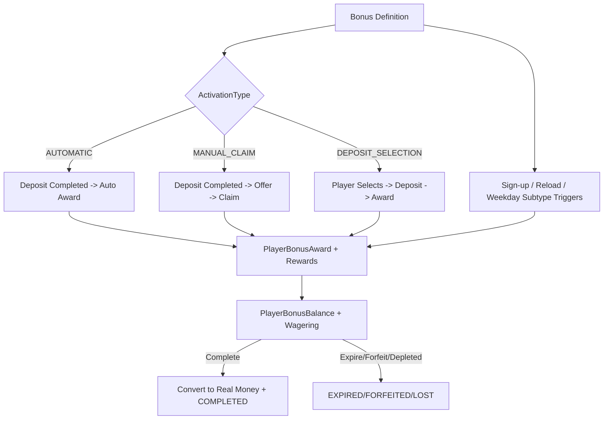

# Bonus Logic (Code-Derived)

This document describes bonus types, creation, eligibility, lifecycle, wagering, and reward processing.
All details are derived from code only.

## Source Files

Core services and event flow:
- `casino-b/src/main/kotlin/com/casino/core/service/BonusService.kt`
- `casino-b/src/main/kotlin/com/casino/core/service/BonusLogicService.kt`
- `casino-b/src/main/kotlin/com/casino/core/service/BonusEligibilityService.kt`
- `casino-b/src/main/kotlin/com/casino/core/service/BonusOfferService.kt`
- `casino-b/src/main/kotlin/com/casino/core/service/BonusSelectionService.kt`
- `casino-b/src/main/kotlin/com/casino/core/service/AdvancedBonusService.kt`
- `casino-b/src/main/kotlin/com/casino/core/service/BonusManagementService.kt`
- `casino-b/src/main/kotlin/com/casino/core/service/BonusBalanceService.kt`
- `casino-b/src/main/kotlin/com/casino/core/service/BonusRewardCalculator.kt`
- `casino-b/src/main/kotlin/com/casino/core/util/BonusWageringModeResolver.kt`
- `casino-b/src/main/kotlin/com/casino/core/event/BonusEventListener.kt`
- `casino-b/src/main/kotlin/com/casino/core/event/BonusRegistrationEventListener.kt`
- `casino-b/src/main/kotlin/com/casino/core/scheduler/BonusExpirationScheduler.kt`

Free spins and campaigns:
- `casino-b/src/main/kotlin/com/casino/core/service/FreeSpinsService.kt`
- `casino-b/src/main/kotlin/com/casino/core/service/FreeSpinsCallbackService.kt`
- `casino-b/src/main/kotlin/com/casino/core/campaigns/service/CampaignService.kt`
- `casino-b/src/main/kotlin/com/casino/core/campaigns/service/CampaignSyncService.kt`

Entities and enums:
- `casino-b/src/main/kotlin/com/casino/core/domain/Bonus.kt`
- `casino-b/src/main/kotlin/com/casino/core/domain/BonusReward.kt`
- `casino-b/src/main/kotlin/com/casino/core/domain/BonusActivation.kt`
- `casino-b/src/main/kotlin/com/casino/core/domain/BonusSchedule.kt`
- `casino-b/src/main/kotlin/com/casino/core/domain/BonusType.kt`
- `casino-b/src/main/kotlin/com/casino/core/domain/BonusStatus.kt`
- `casino-b/src/main/kotlin/com/casino/core/domain/BonusCategory.kt`
- `casino-b/src/main/kotlin/com/casino/core/domain/RewardType.kt`
- `casino-b/src/main/kotlin/com/casino/core/domain/ActivationType.kt`
- `casino-b/src/main/kotlin/com/casino/core/domain/WageringMode.kt`
- `casino-b/src/main/kotlin/com/casino/core/domain/AwardStatus.kt`
- `casino-b/src/main/kotlin/com/casino/core/domain/AwardSource.kt`
- `casino-b/src/main/kotlin/com/casino/core/domain/OfferStatus.kt`
- `casino-b/src/main/kotlin/com/casino/core/domain/PlayerBonusAward.kt`
- `casino-b/src/main/kotlin/com/casino/core/domain/PlayerBonusBalance.kt`
- `casino-b/src/main/kotlin/com/casino/core/domain/PlayerBonusOffer.kt`
- `casino-b/src/main/kotlin/com/casino/core/domain/PlayerBonusSelection.kt`
- `casino-b/src/main/kotlin/com/casino/core/domain/BonusFreeSpinsConfig.kt`
- `casino-b/src/main/kotlin/com/casino/core/domain/BonusFreeSpinsCampaignMapping.kt`
- `casino-b/src/main/kotlin/com/casino/core/domain/PlayerFreeSpinsAward.kt`
- `casino-b/src/main/kotlin/com/casino/core/domain/ReloadBonusConfig.kt`
- `casino-b/src/main/kotlin/com/casino/core/domain/PlayerReloadBonusUsage.kt`

Sports betting bonus types:
- `casino-b/src/main/kotlin/com/casino/core/sports/domain/SportsBet.kt`

## Enumerations and Types

Core bonus type (`BonusType`):
```
DEPOSIT
NTH_DEPOSIT
ANY_DEPOSIT
RELOAD
NO_DEPOSIT
DEPOSIT_MATCH  // legacy compatibility
```

Bonus subtype (`Bonus.bonusSubtype`) is a string. The code recognizes these values:
```
SIGN_UP
RELOAD
NTH_DEPOSIT
ANY_DEPOSIT
WEEKDAY_SPECIAL
```

Bonus status (`BonusStatus`):
```
DRAFT
ACTIVE
INACTIVE
EXPIRED
```

Bonus category (`BonusCategory`):
```
SPORTS
SLOTS
```

Activation type (`ActivationType`):
```
AUTOMATIC
MANUAL_CLAIM
DEPOSIT_SELECTION
```

Reward type (`RewardType`):
```
MONEY
FREE_SPINS
SPORTS_BONUS
```

Wagering mode (`WageringMode`):
```
BONUS_ONLY
DEPOSIT_PLUS_BONUS
```

Player bonus award status (`AwardStatus`):
```
ACTIVE
ACTIVATED
COMPLETED
EXPIRED
FORFEITED
LOST
```

Award source (`AwardSource`):
```
SYSTEM
ADMIN
MANUAL
SIGN_UP
SMARTICO_CASHBACK
SMARTICO_BONUS
```

Offer status (`OfferStatus`):
```
AVAILABLE_TO_CLAIM
CLAIMED
EXPIRED
ALREADY_CLAIMED
CANCELLED
```

Free spins source and status:
```
FreeSpinsSource: LOCAL_BONUS, EXTERNAL_CAMPAIGN
FreeSpinsAwardStatus: ACTIVE, USED, EXPIRED, CANCELLED
```

Sports betting bonus types (BetBy domain):
```
FREEBET_REFUND
FREEBET_FREEMONEY
FREEBET_NO_RISK
GLOBAL_COMBOBOOST
COMBOBOOST
```

## Core Data Model

### Bonus (definition)
`Bonus` is the master template that determines eligibility, rules, rewards, and targeting.
Key fields and behaviors:
- Type and subtype: `type` is enum, `bonusSubtype` is a string used by eligibility rules.
- Dates: `validFrom`, `validTo` gate activity (via `Bonus.isActive()` in code).
- Activation: stored in `BonusActivation` with `activationType`.
- Currencies and limits: `eligibleCurrenciesJson`, per-currency deposit limits, max bet, min terminate, max win.
- Player targeting: country whitelist/blacklist, affiliate IDs, segment IDs, required sign-up codes.
- Compliance gating: KYC requirement + optional categories.
- Category: SPORTS or SLOTS, enforced for reward compatibility.
- Promotions metadata: tags, internal notes, terms and conditions, banner URL, localized details.
- Scheduling: per-day time windows in `BonusSchedule`.
- Copy support: `isCopyable`, `copiedFromBonusId`.

### BonusReward (rewards)
`BonusReward` defines one reward line for a bonus:
- Money vs free spins vs sports bonus.
- Fixed amount (`amount`) or percentage (`percentage`) with optional `maxAmount`.
- Currency scope, reward order, and wagering configuration.
- `wageringMultiplier` and `wageringMode` define wagering requirements.
- Game contribution factors are encoded as `contributingGames` in `GAME:factor` format.
- Sports bonus requires `externalTemplateId`.

### Player awards and balances
- `PlayerBonusAward` records the award lifecycle and status.
- `PlayerBonusBalance` tracks bonus funds, locked deposits, wagering requirement and completion.
- `BonusDepositAssociation` stores deposit wagering state for later restoration.
- `PlayerBonusOffer` stores manual claim offers.
- `PlayerBonusSelection` stores a deposit-selected bonus for 30 minutes.

### Free spins configuration
`BonusFreeSpinsConfig` supports:
- Local free spins awarding (spin count/value/eligible games/expiry/max win).
- External campaign integration, either legacy single campaign or multi-currency mappings.
- Campaign mappings are stored in `BonusFreeSpinsCampaignMapping`.

## Bonus Creation and Configuration

`BonusService.createBonus()` enforces and persists the bonus definition:
- Ensures unique `code`.
- Validates schedules (unique day, 1-7 day-of-week, 0-23 hours).
- Validates category vs reward types (SPORTS cannot use FREE_SPINS, SLOTS cannot use SPORTS_BONUS).
- Validates sports bonus rewards (must have amount or percentage, and external template ID).
- Persists `Bonus`, `BonusActivation`, `BonusReward`, `BonusDetails`, and `BonusSchedule`.
- Creates `BonusFreeSpinsConfig` for FREE_SPINS rewards with campaign links or mappings.

`AdvancedBonusService` adds advanced configuration:
- Weekday schedules via `BonusSchedule`.
- Reload bonus configuration via `ReloadBonusConfig` (deposit triggers, usage caps, period).

`BonusManagementService` supports:
- Manual bonus award to a player.
- Copying an existing bonus with `CopyType`.
- Tag updates and tag-based search.

## Eligibility Pipeline

Eligibility is centralized in `BonusEligibilityService`:
- Bonus must be active (`BonusStatus.ACTIVE` and `Bonus.isActive()` date window).
- Player must exist and not be globally restricted from bonuses.
- Player must not be restricted for the specific bonus.
- Bonus must not already be awarded to the player.
- Currency must be eligible (bonus or wallet currency).
- Country must pass whitelist/blacklist checks.
- KYC must be verified if required, with category checks when configured.
- Affiliate and segment targeting must match if configured.
- Required sign-up code must match (case-insensitive).
- Subtype rules:
  - SIGN_UP: only if `depositCount == 0`.
  - RELOAD: only if `depositCount > 0`.
  - NTH_DEPOSIT: only if player is on the required deposit number.
  - ANY_DEPOSIT: no additional restriction.
- Deposit-specific rules (when a deposit event is present):
  - Payment method must be in bonus paymentMethods if configured.
  - Deposit amount must meet minimum per-currency limit if configured.
- Schedule rules (when schedules exist): timezone-aware day/hour checks in `BonusSchedule`.

Behavioral notes based on code:
- `useDefaultBlacklist` is stored but currently not enforced in eligibility logic.
- `minDaysSinceLastDeposit` exists in `ReloadBonusConfig` but is not enforced yet.

## Activation and Awarding Flows

### Deposit-triggered flow (automatic and selection)
`BonusEventListener.handleDepositCompleted()` runs after deposit commits:
- `BonusLogicService.processDepositEvent()` first checks for an active `PlayerBonusSelection`.
- If a selection exists, it awards the selected bonus and deletes the selection.
- If no selection exists, it awards the highest-priority eligible AUTOMATIC bonus.
- Manual claim offers are created for eligible MANUAL_CLAIM bonuses.
- Reload bonuses are processed (`AdvancedBonusService.processReloadBonuses`).
Award creation details for automatic/selection flow:
- `PlayerBonusAward` is created with default status `ACTIVATED` and `AwardSource.SYSTEM`.
- `depositAmount` and `eventId` are recorded from the deposit event.

### Manual claim offers
`BonusOfferService.createOffersForDeposit()` creates `PlayerBonusOffer` records after deposit.
- Offers can expire based on `offerExpirationHours`.
- Hourly scheduler marks expired offers.

`BonusOfferService.claimOffer()`:
- Validates ownership, status, expiry, restrictions, and already-awarded checks.
- Uses a pessimistic lock to ensure only one active bonus at a time.
- Creates a `PlayerBonusAward` with `AwardStatus.ACTIVE` and processes rewards.
- Cancels all other available offers for the player.

### Deposit selection bonuses
`BonusSelectionService`:
- Lists eligible DEPOSIT_SELECTION bonuses.
- Stores `PlayerBonusSelection` for 30 minutes.
- Selection is consumed on the next deposit in `BonusLogicService.processDepositEvent()`.
- Scheduled cleanup removes expired selections every 5 minutes.

### Sign-up bonuses
Two code paths handle sign-up:
- `BonusRegistrationEventListener` (PlayerRegisteredEvent) creates offers for SIGN_UP bonuses.
  - If activation is AUTOMATIC, it creates an offer and immediately claims it.
  - If activation is MANUAL_CLAIM, it creates an offer only.
- `BonusEventListener.handleSignUpCompleted()` awards NO_DEPOSIT + SIGN_UP bonuses directly.
  - Checks currency rewards and country eligibility.
  - Calls `BonusLogicService.awardSignUpBonus()`.
Sign-up award status behavior:
- `awardSignUpBonus()` creates a `PlayerBonusAward` with default status `ACTIVATED` and `AwardSource.SIGN_UP`.
- The auto-claim offer path creates awards via `BonusOfferService.claimOffer()` with status `ACTIVE`.

### Reload bonuses
`AdvancedBonusService.processReloadBonuses()` runs on deposits:
- Finds ACTIVE bonuses with bonusSubtype == RELOAD.
- Uses `ReloadBonusConfig` and `PlayerReloadBonusUsage` to enforce:
  - max uses per player
  - reload period days
  - deposit number trigger
- Updates usage count and `nextEligibleAt`.
- For MANUAL_CLAIM activation, creates offers; otherwise auto-award is handled by normal bonus flow.

### Manual admin award
`BonusManagementService.manuallyAwardBonus()`:
- Creates `PlayerBonusAward` with `AwardStatus.ACTIVE` and `AwardSource.MANUAL`.
- Processes each reward line using `BonusLogicService.processReward()`.

## Reward Processing

### Money rewards
`BonusRewardCalculator`:
- Fixed amount uses `amount`.
- Percentage uses `depositAmount * percentage / 100` (rounded down to 2 decimals), capped by `maxAmount`.

`BonusLogicService.processMoneyReward()`:
- Creates `PlayerMoneyAward` without crediting the real wallet.
- Creates `PlayerBonusBalance` for all money rewards (even with zero wagering).
- Publishes bonus awarded events and Smartico Kafka events.

Manual claim rewards use:
- `processFixedAmountReward()` for fixed amount.
- `processPercentageReward()` for percent-based rewards.

### Free spins rewards
`BonusLogicService.processFreeSpinsReward()`:
- Loads `BonusFreeSpinsConfig` with campaign mappings.
- Resolves campaign by player wallet currency.
- If mapping exists: adds player to external campaign (no local spins).
- If legacy campaign exists and currency matches: adds player to campaign.
- If mappings exist but no currency match: skips free spins reward.
- If no campaigns exist: awards local spins via `FreeSpinsService.awardFreeSpins()`.

`FreeSpinsCallbackService`:
- Tracks external free spin BET/WIN callbacks (context.reason == PROMO-FREESPIN).
- Updates spins used and total winnings, enforces max win caps.

### Sports bonus rewards
`BonusLogicService.processSportsBonusReward()`:
- Requires `externalTemplateId`.
- Calculates bonus amount from percentage or fixed amount.
- Uses wallet currency and `BonusAssignmentService.assignBonusToPlayer()`.

## Wagering and Balance Management

### Wagering base and mode
`BonusBalanceService.createBonusBalance()`:
- Applies `BonusWageringModeResolver`: if configured mode is DEPOSIT_PLUS_BONUS and `nthDepositNumber > 1`, it forces BONUS_ONLY.
- Wagering base:
  - BONUS_ONLY: bonus amount.
  - DEPOSIT_PLUS_BONUS: bonus amount + deposit amount.
- If DEPOSIT_PLUS_BONUS, it cancels active deposit wagering and locks the deposit amount.
- Records `BonusDepositAssociation` for later deposit wagering restoration.

### Wagering progress
Two sources update wagering progress:
- `WageringService.processGameRoundWagering()` for in-platform game rounds.
- `ProviderIntegrationService.processBetTransactionCached()` for provider callbacks.

Contribution factors:
- `BonusReward.parseGameContributions()` parses `contributingGames` to a map of game->factor.
- Default contribution is `ALL:1.0` when not configured.

### Completion
`BonusBalanceService.checkAndCompleteWagering()`:
- Releases locked deposit.
- Converts bonus to real money via `TransactionType.BONUS_CONVERSION`.
- Marks `PlayerBonusAward` as COMPLETED.
- Publishes Smartico events and wagering completion WebSocket notifications.

## Forfeit, Expiry, and Loss

### Expiry
- `BonusExpirationScheduler` runs hourly and expires balances via `BonusBalanceService.expireOutdatedBalances()`.
- Expired balances zero out bonus, mark award EXPIRED, and publish forfeited events.

### Forfeit by player
`BonusService.forfeitBonus()`:
- Marks award FORFEITED with cancellation metadata.
- Deactivates bonus balance and zeroes bonus amount.
- Restores deposit wagering via `BonusDepositAssociation` if applicable.
- Cancels local free spins and removes player from external campaigns.

### Forfeit on new deposit
`WalletService.credit()` for deposits calls `BonusBalanceService.removeActiveBonusesOnDeposit()`:
- Deactivates active bonus balances and publishes forfeited events.

### Lost bonus (depleted)
- `BonusBalanceService.deductFromBalance()` and `HighPerformanceWalletService.deactivateDepletedBonus()` mark award LOST when bonus amount reaches zero.

## Admin and Player Views

Admin operations are exposed via controllers and services:
- Create/update bonuses, statuses, activation types.
- Configure schedules and reload rules.
- Manually award bonuses and copy existing bonuses.

Player-facing operations:
- Fetch available offers and active bonuses.
- Claim offers.
- Select deposit bonuses and view selections.
- View free spins balance and history.

## Smartico/CRM Integration

Bonus lifecycle events are published through the Smartico Kafka integration:
- Bonus awarded, completed, forfeited events include wagering details, amounts, and player metadata.
- Smartico endpoints exist for active/activate bonus flows:
  - `/api/v1/smartico/bonuses/active`
  - `/api/v1/smartico/bonuses/activate`

## Summary Lifecycle Flow


