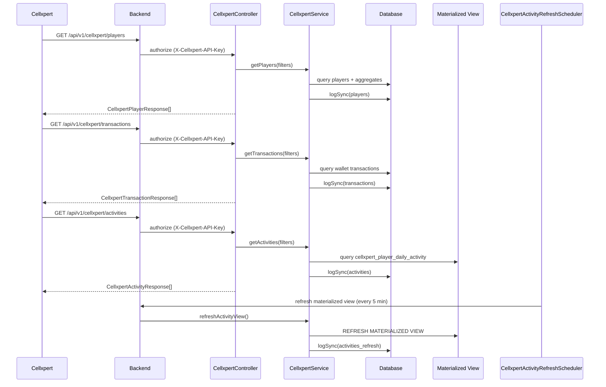

# Cellxpert Affiliate Integration

This document covers Cellxpert affiliate tracking integration in `casino-b`. All details are derived from code.

## Source Files

- `casino-b/src/main/kotlin/com/casino/core/controller/CellxpertController.kt`
- `casino-b/src/main/kotlin/com/casino/core/service/CellxpertService.kt`
- `casino-b/src/main/kotlin/com/casino/core/dto/CellxpertDtos.kt`
- `casino-b/src/main/kotlin/com/casino/core/security/ApiKeyAuthenticationFilter.kt`
- `casino-b/src/main/kotlin/com/casino/core/scheduler/CellxpertActivityRefreshScheduler.kt`
- `casino-b/src/main/kotlin/com/casino/core/domain/CellxpertConfig.kt`
- `casino-b/src/main/kotlin/com/casino/core/domain/CellxpertSyncLog.kt`

## Authentication

- API key header: `X-Cellxpert-API-Key`.
- Key is validated by `ApiKeyAuthenticationFilter` against a SHA-256 hash stored in `CellxpertConfig` in the database.
- If configuration is missing, requests return `503 Cellxpert integration not configured`.

All `/api/v1/cellxpert/*` endpoints require the API key header.
Most endpoints are additionally guarded by `@PreAuthorize("hasAuthority('CELLXPERT_API') or hasAuthority('ADMIN')")`.
`POST /refresh-activities` requires `ADMIN` authority on top of the API key.

## API Endpoints

Base path: `/api/v1/cellxpert`

### GET /players
Returns players with Cellxpert tracking tokens.

Filters (all optional unless noted):
- `registrationDateFrom`, `registrationDateTo` (ISO 8601 date-time)
- `lastModifiedDateFrom`, `lastModifiedDateTo` (ISO 8601 date-time)
- `playerId` (overrides date filters)
- `affId`

Response: list of `CellxpertPlayerResponse`.

Key response fields:
- player_id, CXD, AffId, Status
- RegistrationDate, LastModifiedDate
- ISOCountry, UserIPAddress
- FirstDepositDate, FirstDepositAmount, FirstDepositCurrency
- TotalDepositAmount, DepositCount
- TotalWithdrawalAmount, WithdrawalCount
- NetDeposit, PrimaryCurrency

### GET /transactions
Returns deposits, withdrawals, and chargebacks for commission calculations.

Required filters:
- `transactionDateFrom`, `transactionDateTo` (ISO 8601 date-time)
Optional:
- `playerId`

Response: list of `CellxpertTransactionResponse`.

Transaction mapping rules:
- Only transactions for players with `cellxpertToken` are included.
- Withdrawals are negative amounts.
- `transaction_type` is mapped from internal `TransactionType`.

### GET /activities
Returns aggregated daily betting activity (GGR) using a materialized view.

Required filters:
- `activityCloseDateFrom`, `activityCloseDateTo` (YYYY-MM-DD)
Optional:
- `playerId`

Response: list of `CellxpertActivityResponse`:
- activity_date
- bets, bonus, revenue, stake
- activity_currency

Data source:
- SQL query against `cellxpert_player_daily_activity` view.

### GET /health
Returns integration status plus recent sync logs.

### POST /refresh-activities
Triggers a refresh of the Cellxpert activity materialized view (ADMIN only).

## Admin Endpoints

Base path: `/api/v1/admin/cellxpert`

- `GET /config` -> returns `CellxpertConfig`
- `PUT /config` -> updates `CellxpertConfig` from `CellxpertConfigRequest`
- `GET /players` -> paginated list of tracked players
- `GET /players/by-token/{token}` -> player lookup by Cellxpert token
- `GET /activity/sync` -> activity sync payload with summary metadata
- `POST /refresh-view` -> refreshes materialized view

## Schemas (Code-Derived)

### CellxpertPlayerResponse

| Field | Type | Notes |
| --- | --- | --- |
| player_id | number | player id |
| CXD | string | Cellxpert tracking token |
| AffId | string? | affiliate id |
| Status | string? | player status |
| RegistrationDate | string | ISO date-time |
| LastModifiedDate | string | ISO date-time |
| ISOCountry | string | ISO country code |
| UserIPAddress | string? | optional |
| FirstDepositDate | string? | ISO date-time |
| FirstDepositAmount | number? | optional |
| FirstDepositCurrency | string? | optional |
| TotalDepositAmount | number? | optional |
| DepositCount | number? | optional |
| TotalWithdrawalAmount | number? | optional |
| WithdrawalCount | number? | optional |
| NetDeposit | number? | optional |
| PrimaryCurrency | string? | optional |

### CellxpertTransactionResponse

| Field | Type | Notes |
| --- | --- | --- |
| player_id | number | player id |
| transaction_id | string | transaction id |
| transaction_Date | string | ISO date-time (note capital D) |
| transaction_type | string | Deposit/Withdrawal/Adjustment/etc |
| transaction_amount | number | signed amount |
| transaction_currency | string | currency code |

### CellxpertActivityResponse

| Field | Type | Notes |
| --- | --- | --- |
| player_id | number | player id |
| activity_date | string | YYYY-MM-DD |
| bets | number | total bets |
| bonus | number | bonus amount |
| revenue | number | GGR |
| stake | number | total stake |
| activity_currency | string | currency code |

### Health Response (GET /health)

| Field | Type | Notes |
| --- | --- | --- |
| status | string | UP |
| integration | string | integration name |
| recentSyncs | array | list of {type, time, records, status} |
| recentFailures | array | list of {type, time, error} |

### CellxpertConfigRequest

| Field | Type | Notes |
| --- | --- | --- |
| parameterName | string | default "cxd" |
| affiliateParamName | string? | default "affid" |
| apiEnabled | boolean | true/false |
| apiKeyHash | string? | SHA-256 hash |
| syncIntervalMinutes | number | min 1 |

### CellxpertConfig

| Field | Type | Notes |
| --- | --- | --- |
| id | number | config id |
| parameterName | string | query param name |
| affiliateParamName | string? | affiliate param name |
| apiEnabled | boolean | enabled flag |
| apiKeyHash | string? | stored hash |
| lastSyncTimestamp | string? | ISO date-time |
| syncIntervalMinutes | number | sync interval |
| createdAt | string | ISO date-time |
| updatedAt | string | ISO date-time |

## Sync Logging

`CellxpertSyncLog` tracks syncs with:
- syncType (players/transactions/activities)
- syncStartTime, syncEndTime
- recordsSynced
- status, errorMessage

`CellxpertService.logSync` writes logs after each request.

## Scheduler

`CellxpertActivityRefreshScheduler` refreshes the activity view every 5 minutes.
This is important because Cellxpert can poll activities frequently.

## Tracking Token Capture

- `cellxpertToken` is stored on `Player` and captured during registration.
- DTOs also support `cellxpert_token` in lead creation flows.

## Sequence Diagram: Cellxpert Polling + Activity Refresh

