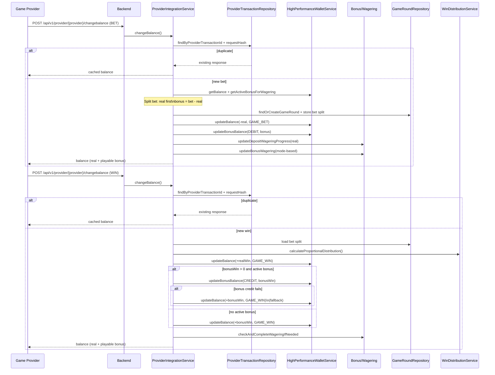
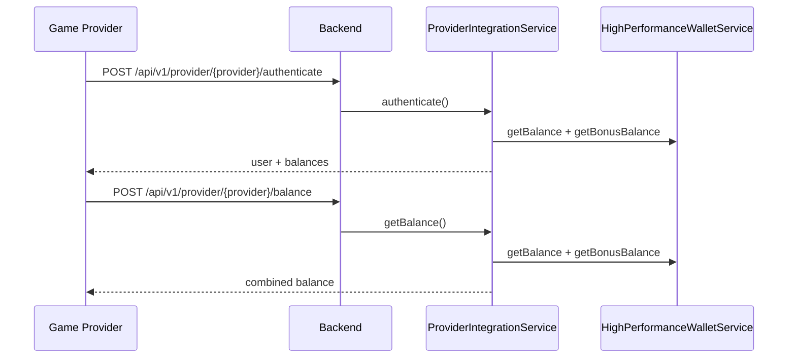
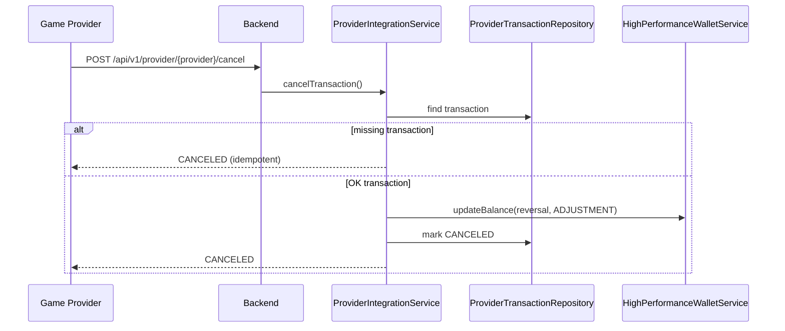
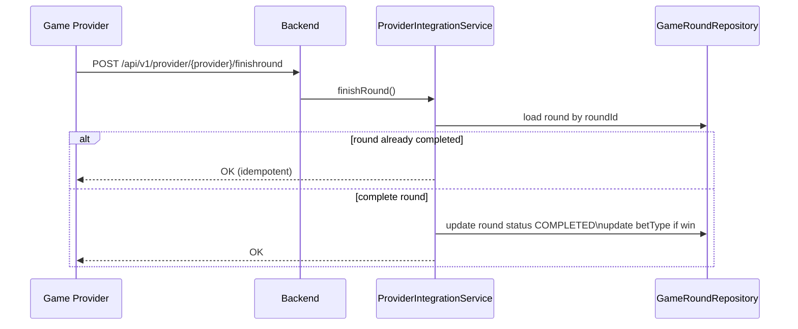

# Game Provider Integration (Wallet Callbacks + Sync)

This document describes the external game provider integration layer in `casino-b`.
All details are derived from code.

## Source Files

Provider wallet callbacks and security:
- `casino-b/src/main/kotlin/com/casino/core/controller/ProviderCallbackController.kt`
- `casino-b/src/main/kotlin/com/casino/core/service/ProviderIntegrationService.kt`
- `casino-b/src/main/kotlin/com/casino/core/service/ProviderResponseService.kt`
- `casino-b/src/main/kotlin/com/casino/core/service/ProviderSecurityService.kt`
- `casino-b/src/main/kotlin/com/casino/core/dto/provider/*`

Provider management and sync:
- `casino-b/src/main/kotlin/com/casino/core/controller/GameProviderController.kt`
- `casino-b/src/main/kotlin/com/casino/core/controller/GameProviderSyncController.kt`
- `casino-b/src/main/kotlin/com/casino/core/service/GameProviderSyncService.kt`

Wallet and wagering:
- `casino-b/src/main/kotlin/com/casino/core/service/HighPerformanceWalletService.kt`
- `casino-b/src/main/kotlin/com/casino/core/service/DepositWageringService.kt`
- `casino-b/src/main/kotlin/com/casino/core/service/BonusBalanceService.kt`
- `casino-b/src/main/kotlin/com/casino/core/service/WinDistributionService.kt`

## Callback API Surface

Base path: `/api/v1/provider/{provider}`

Endpoints:
- `POST /authenticate`
- `POST /balance`
- `POST /changebalance`
- `POST /status`
- `POST /cancel`
- `POST /finishround`
- `GET  /ping`

### Request Envelope

All POST endpoints use `ProviderApiRequest<T>`:
- `command`
- `request_timestamp`
- `hash`
- `data` (request-specific payload)

### Response Envelope

All responses use `ProviderApiResponse`:
- `status`: `OK` or `ERROR`
- `response_timestamp`
- `hash`
- `data`: success payload or error payload

### Headers and Security

Required headers:
- `X-Operator-Id` matches configured operator id.
- `X-Authorization` matches expected hash for the command.

Hash logic (`ProviderSecurityService`):
- Authorization hash: `SHA1(command + secretKey)` in the current controller path.
- A `SHA1(command + operatorId + secretKey)` variant exists but is not used by `ProviderCallbackController` (includeOperatorId=false).
- Request hash: `SHA1(command + request_timestamp + secretKey)`
- Response hash: `SHA1(status + response_timestamp + secretKey)`

Implementation detail:
- `validateAuthorizationHeader` and `validateRequestHash` log mismatches but currently return `true`. Only header presence and operatorId match are enforced.

## Business Logic by Endpoint

### Authenticate

- Validates session token via `GameSessionCacheService`.
- Rejects blocked players.
- Returns wallet + bonus balance.

### Balance

- Requires valid session token and currency match.
- Returns combined real + bonus balance.

### Change Balance

`ProviderIntegrationService.processBetTransactionCached()` handles BET/WIN/REFUND.

Idempotency:
- Provider transaction is keyed by `transaction_id` + provider.
- Same transaction ID with different hash returns error `OP_40`.

#### BET

Validation:
- Player status and session status.
- Game availability and restrictions.
- Bet limits and session time limit.
- Buy-feature bets are rejected if bonus funds would be used.

Wallet updates:
- Bet is split real first, then bonus.
- Real portion: `HighPerformanceWalletService.updateBalance(TransactionType.GAME_BET)`.
- Bonus portion: `HighPerformanceWalletService.updateBonusBalance(BonusOperation.DEBIT)`.

Wagering sync:
- Deposit wagering updated for real portion if:
  - no active bonus, or
  - bonus mode is BONUS_ONLY.
- Bonus wagering updated based on wagering mode and contribution factor.

Game rounds:
- `findOrCreateGameRound()` stores bet split (`realBetAmount` / `bonusBetAmount`).
- Bet type stored for proportional win distribution.

#### WIN

- Uses `WinDistributionService` to split wins based on stored bet split.
- Real win credited via `HighPerformanceWalletService.updateBalance(TransactionType.GAME_WIN)`.
- Bonus win credited via `HighPerformanceWalletService.updateBonusBalance(BonusOperation.CREDIT)`.
- If bonus credit fails, falls back to real wallet credit.

#### REFUND

- Credits real wallet balance.
- Marks game round VOIDED if present.

### Status

- Returns status from stored provider transaction.

### Cancel

- If transaction missing, returns CANCELED for idempotency.
- If transaction exists, reverses balance and marks provider transaction CANCELED.

### Finish Round

- Marks round as COMPLETED.
- Updates bet type if there was a win.

## Wagering Synchronization Rules

Deposit wagering:
- Updated only for real-money portion when bonus mode is BONUS_ONLY.
- Skipped when bonus mode is DEPOSIT_PLUS_BONUS (bonus wagering already includes deposit).

Bonus wagering:
- Contribution factor pulled from bonus reward configuration.
- Wagering base depends on mode:
  - BONUS_ONLY: bonus portion
  - DEPOSIT_PLUS_BONUS: full bet

## Sequence Diagrams

### Change Balance (BET -> WIN)

### Authenticate + Balance

### Cancel Transaction

### Finish Round

## Request/Response Schemas (Code-Derived)

### ProviderApiRequest

| Field | Type | Notes |
| --- | --- | --- |
| command | string | command name (authenticate/balance/changebalance/status/cancel/finishround) |
| request_timestamp | string | request timestamp from provider |
| hash | string | request hash used for idempotency + auth validation |
| data | object | command-specific payload |

### ProviderApiResponse

| Field | Type | Notes |
| --- | --- | --- |
| status | string | OK or ERROR |
| response_timestamp | string | timestamp generated by backend |
| hash | string | response hash |
| data | object | response payload or error payload |

### ChangeBalance Request (data)

| Field | Type | Notes |
| --- | --- | --- |
| token | string? | required for BET unless PROMO-FREESPIN; optional for WIN/REFUND |
| user_id | string | required, max 70 chars (player id as string) |
| transaction_type | string | BET / WIN / REFUND |
| transaction_id | number | required, positive |
| round_id | number | required, positive |
| round_finished | boolean? | optional |
| game_id | number | required, max 6 digits |
| currency_code | string | required, max 4 chars |
| amount | number | required, non-negative |
| transaction_timestamp | string | required, timestamp string |
| context | object? | promo free spin + campaign context |

### ChangeBalance Response (data)

| Field | Type | Notes |
| --- | --- | --- |
| balance | number | real + playable bonus balance |
| currency_code | string | wallet currency |

### Authenticate Request (data)

| Field | Type | Notes |
| --- | --- | --- |
| token | string | required, 20-50 chars, alphanumeric only |

### Authenticate Response (data)

| Field | Type | Notes |
| --- | --- | --- |
| user_id | string | provider user id |
| user_name | string | username |
| user_country | string | ISO country code |
| display_name | string? | optional display name |
| group | string? | optional group |
| currency_code | string | wallet currency |
| balance | number | real + playable bonus balance |

### Balance Request (data)

| Field | Type | Notes |
| --- | --- | --- |
| token | string | required, max 50 chars |
| currency_code | string | required, max 4 chars |
| user_id | string | required, max 70 chars |

### Balance Response (data)

| Field | Type | Notes |
| --- | --- | --- |
| balance | number | real + playable bonus balance |
| currency_code | string | wallet currency |

### Cancel Request (data)

| Field | Type | Notes |
| --- | --- | --- |
| user_id | string | required, max 70 chars |
| transaction_id | number | required, positive |
| round_id | number | required, positive |
| round_finished | boolean? | optional |
| game_id | number | required, max 6 digits |

### Cancel Response (data)

| Field | Type | Notes |
| --- | --- | --- |
| user_id | string | provider user id |
| transaction_id | number | provider transaction id |
| transaction_status | string | CANCELED |

### Status Request (data)

| Field | Type | Notes |
| --- | --- | --- |
| user_id | string | required, max 70 chars |
| transaction_id | number | required, positive |
| transaction_type | string | BET / WIN / REFUND |
| transaction_date | string | timestamp string |
| transaction_ts | string | 13-digit epoch string |
| round_id | number | required, positive |

### Status Response (data)

| Field | Type | Notes |
| --- | --- | --- |
| user_id | string | provider user id |
| transaction_id | number | provider transaction id |
| transaction_status | string | OK / ERROR / CANCELED |

### FinishRound Request (data)

| Field | Type | Notes |
| --- | --- | --- |
| round_id | number | required, positive |
| user_id | string | required, max 70 chars |
| game_id | number | required, max 6 digits |
| round_date | string | timestamp string |
| round_ts | string | 13-digit epoch string |

### FinishRound Response (data)

| Field | Type | Notes |
| --- | --- | --- |
| round_id | number | round id |
| user_id | string | provider user id |
| game_id | number | game id |

## Provider Sync (Game List)

`GameProviderSyncService`:
- Syncs game list for provider `TLT` using `PlatformApiService.getAllGames()`.
- Creates categories if missing.
- Processes batches and writes sync history.
- Disables games not present in provider data.

## Observability

- Provider callbacks are logged by `GameCallbackLoggingFilter`.
- Sync history is stored in `GameProviderSyncHistory`.
