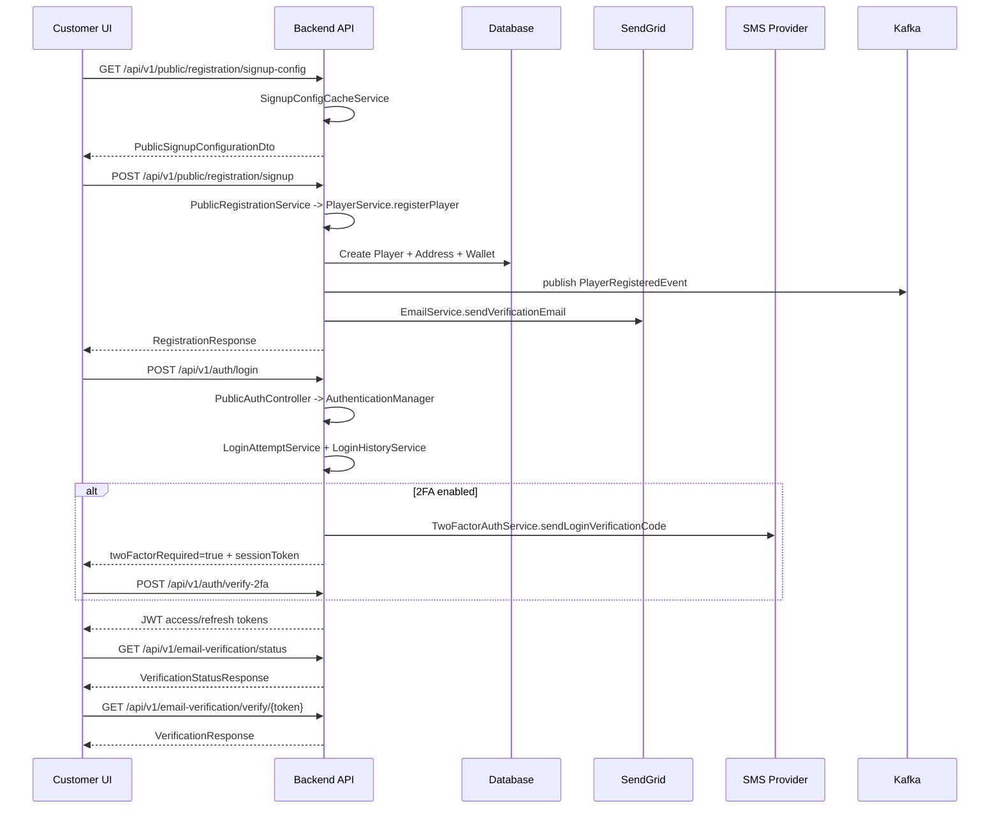
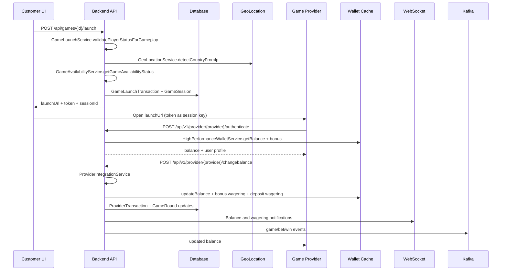
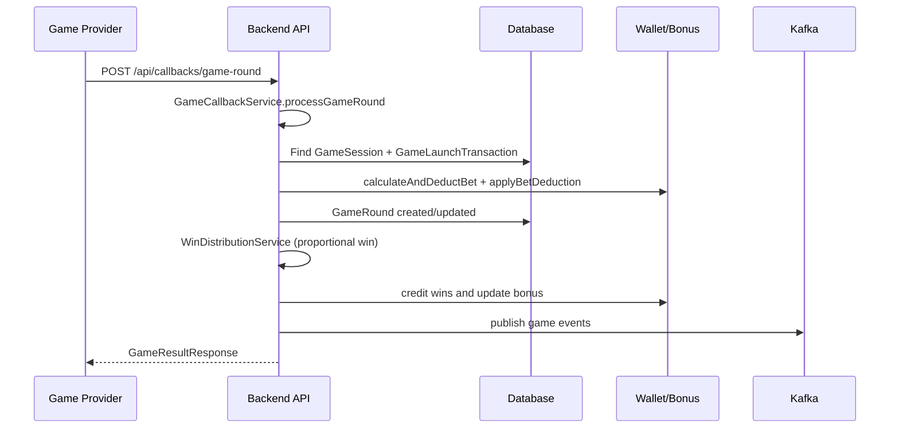
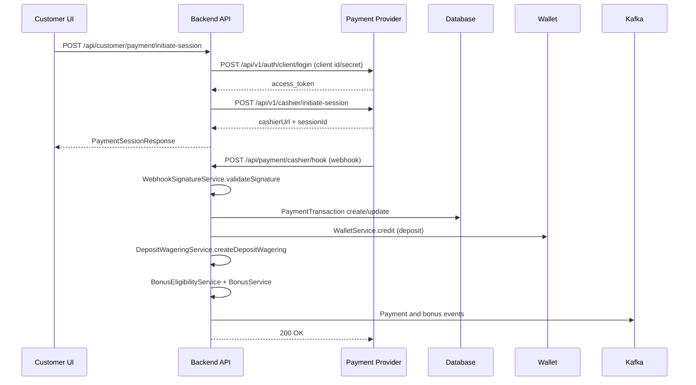
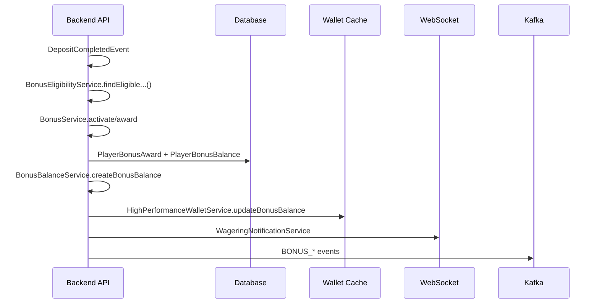
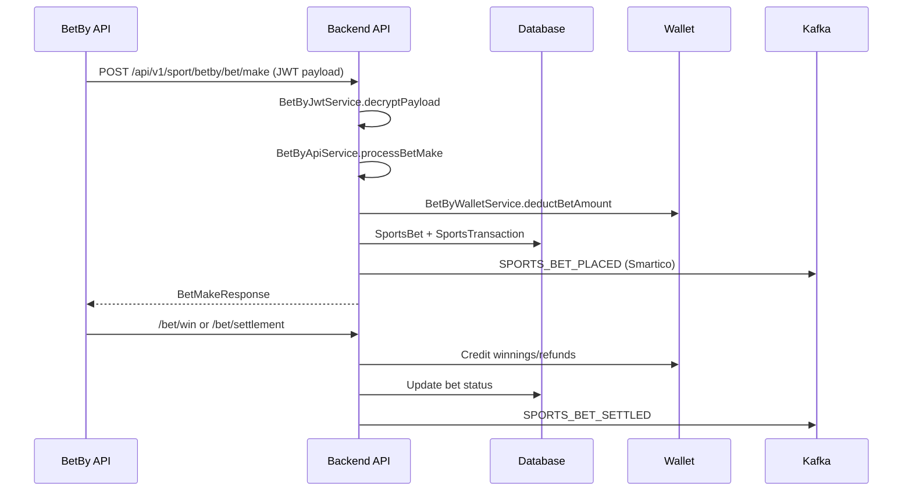
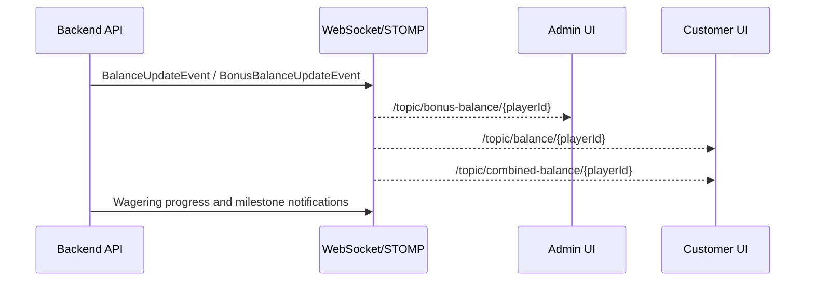
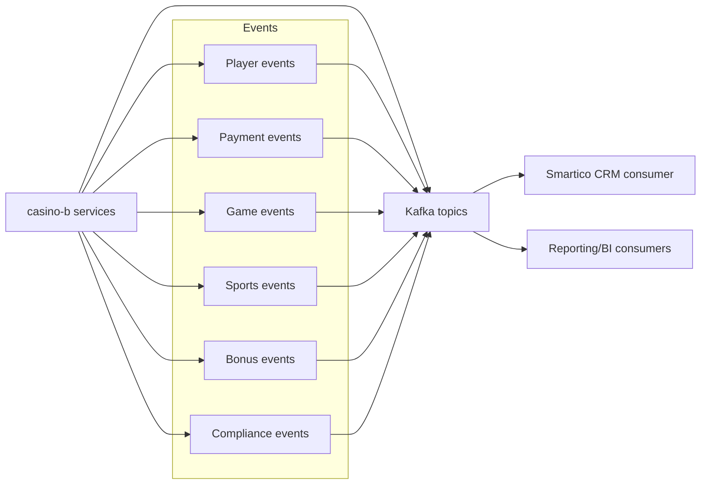

# Information Movement Schemes (Code-Derived)

This document maps how data moves through the platform and across integrations. Each flow is derived from backend services and frontend routing and services.

## System Actors

- Customer UI: `casino-customer-f/src/app`
- Admin UI: `casino-f/src/app`
- Backend API: `casino-b/src/main/kotlin/com/casino/core`
- Sports API: `casino-b/src/main/kotlin/com/casino/core/sports`
- Data stores: Postgres via JPA repositories
- Messaging: Kafka topics in `com.casino.core.kafka.constants.KafkaTopics`
- Realtime: STOMP/WebSocket controllers in `com.casino.core.controller.*WebSocketController`
- External providers: Payment, game providers, BetBy, Smartico, Cellxpert, Campaigns API

## Flow 1 - Registration, Email Verification, Login, 2FA

Key logic:
- Registration uses dynamic signup config and creates wallet in `PlayerService`.
- Login tracks failed attempts and can block accounts in `LoginAttemptService`.
- 2FA flow uses `TwoFactorAuthService` and SMS provider.
- Email verification gates gameplay and deposits via `ComplianceSettingsService` and `GameLaunchService`/`PaymentService`.

## Flow 2 - Game Launch and Provider Wallet Callbacks

Key logic:
- Launch URL includes operator_id, token, device, language, and optional RTP/bet limits.
- Provider callbacks use request hashing and operator headers in `ProviderSecurityService`.
- Change balance is idempotent by provider transaction ID and request hash.

## Flow 3 - Generic Game Provider Callbacks

Key logic:
- Bet deduction uses real money first, then bonus balances ordered by age.
- Mixed-bet win distribution uses `WinDistributionService`.

## Flow 4 - Deposits, Cashier Session, Webhooks

Key logic:
- Cashier webhooks drive transaction state transitions in `PaymentWebhookService`.
- Email verification requirements can block deposits.

## Flow 5 - Bonus Awarding and Wagering Progress

Key logic:
- DEPOSIT_PLUS_BONUS bonuses cancel active deposit wagering and lock deposit.
- Wagering contribution uses game contribution factors and wagering mode.

## Flow 6 - Sports Betting (BetBy)

## Flow 7 - Realtime Balance, Wagering, and Account Status

## Flow 8 - Kafka Event Publishing (CRM/Analytics)

## Data Movement Summary

- HTTP requests are handled by controller classes in `com.casino.core.controller`.
- Business logic is executed in service classes in `com.casino.core.service` and `com.casino.core.sports.service`.
- Persistent state is stored via JPA repositories in `com.casino.core.repository` and `com.casino.core.sports.repository`.
- High-frequency balance operations use `HighPerformanceWalletService` with local + Redis caches.
- Real-time updates are emitted via WebSocket controllers and event services.
- Cross-system integration relies on explicit protocols documented in `external-protocols.md`.
