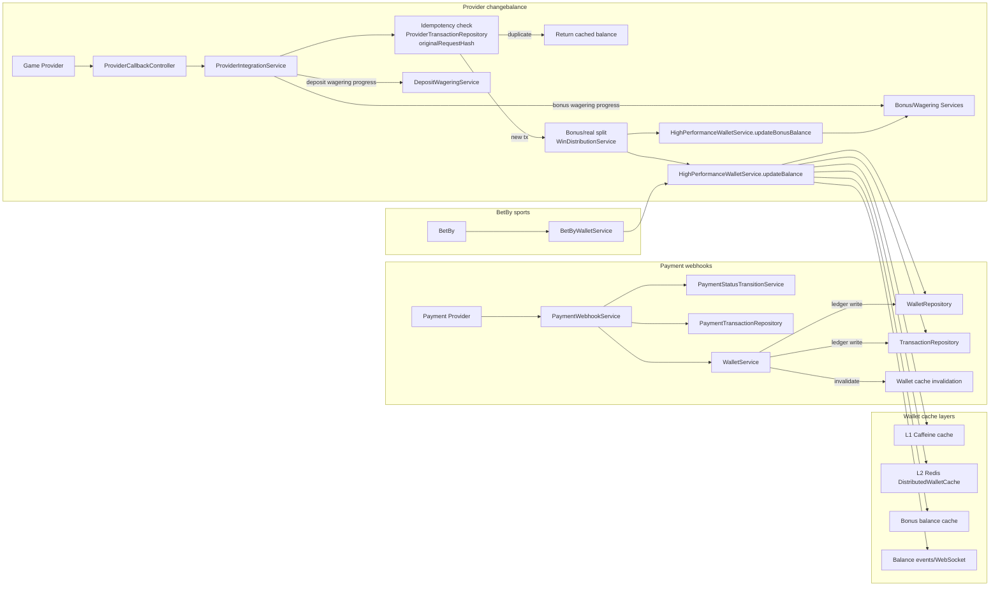
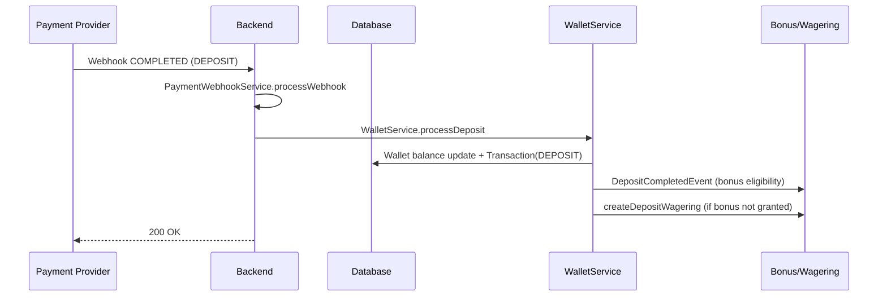
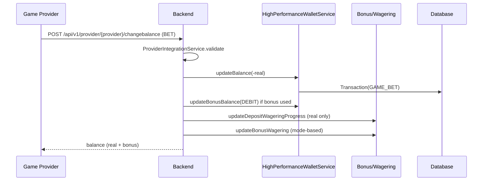
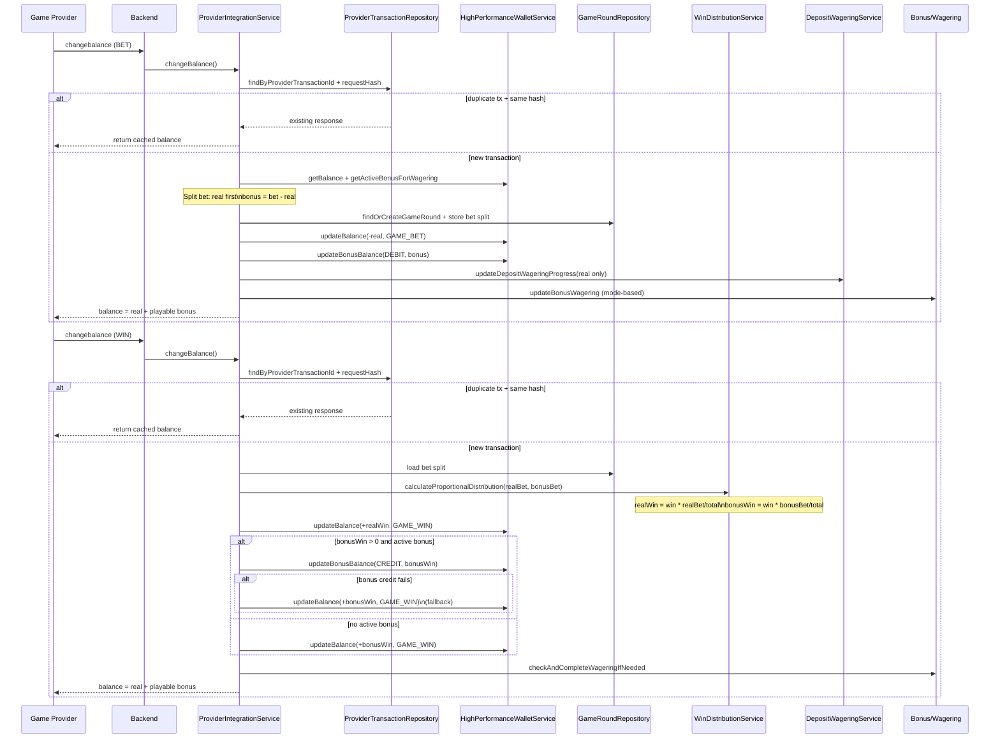
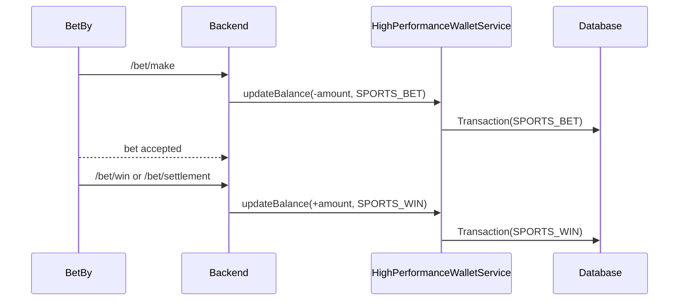
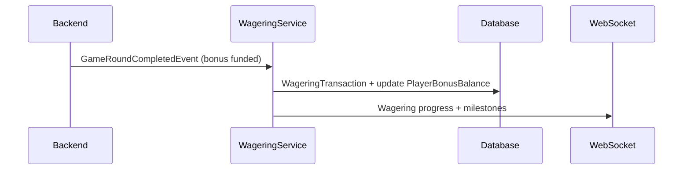

# Wallet and Transaction Logic (Code-Derived)

This document describes how wallet balances, transactions, wagering locks, and payment flows are handled in `casino-b`.
All details are derived from code.

## Source Files

Core wallet and transaction logic:
- `casino-b/src/main/kotlin/com/casino/core/service/WalletService.kt`
- `casino-b/src/main/kotlin/com/casino/core/service/HighPerformanceWalletService.kt`
- `casino-b/src/main/kotlin/com/casino/core/service/WithdrawableBalanceCalculator.kt`
- `casino-b/src/main/kotlin/com/casino/core/service/BalanceCacheService.kt`
- `casino-b/src/main/kotlin/com/casino/core/domain/Transaction.kt`
- `casino-b/src/main/kotlin/com/casino/core/domain/Wallet.kt`

Wagering and locks:
- `casino-b/src/main/kotlin/com/casino/core/service/DepositWageringService.kt`
- `casino-b/src/main/kotlin/com/casino/core/service/WageringService.kt`
- `casino-b/src/main/kotlin/com/casino/core/service/BonusBalanceService.kt`

Payments and webhooks:
- `casino-b/src/main/kotlin/com/casino/core/service/PaymentWebhookService.kt`
- `casino-b/src/main/kotlin/com/casino/core/service/PaymentService.kt`
- `casino-b/src/main/kotlin/com/casino/core/domain/PaymentTransaction.kt`

Sports wallet operations:
- `casino-b/src/main/kotlin/com/casino/core/sports/service/BetByWalletService.kt`

Game callbacks and provider wallet:
- `casino-b/src/main/kotlin/com/casino/core/service/ProviderIntegrationService.kt`
- `casino-b/src/main/kotlin/com/casino/core/service/GameCallbackService.kt`

## Ledger Model and Types

### Wallet and Transaction Entities

- `Wallet` holds the real-money balance and currency for a player.
- `Transaction` is the immutable ledger entry with:
  - `amount` (credits positive, debits negative)
  - `balanceBefore` / `balanceAfter`
  - `referenceId` and `referenceType` for idempotency tracing
  - `providerId` for external transaction linkage
  - `gameRound` link (for game transactions)
  - `fundingSource` (REAL_MONEY / BONUS_MONEY / MIXED)
  - `isTestTransaction` flag

Transaction creation is always paired with a balance change for real money.
Bonus-only operations are tracked in bonus balance tables and use bonus-specific transaction types.

### Transaction Types (from `TransactionType` enum)

Core payments and wallet:
- `DEPOSIT`, `MANUAL_DEPOSIT`, `WITHDRAWAL`, `ADJUSTMENT`, `BATCH_UPDATE`, `BONUS_CREDIT`

Casino gameplay:
- `GAME_BET`, `GAME_WIN`, `GAME_OTHER`, `JACKPOT_WIN`

Sports betting:
- `SPORTS_BET`, `SPORTS_WIN`, `SPORTS_REFUND`, `SPORTS_ROLLBACK`, `SPORTS_CASHOUT`

Bonuses:
- `BONUS_BET`, `BONUS_WIN`, `BONUS_CONVERSION`, `BONUS_EXPIRED`, `BONUS_AWARDED`

Free spins:
- `FREE_SPIN_BET`, `FREE_SPIN_WIN`

### Transaction Statuses

- `PENDING`, `PROCESSING`, `COMPLETED`, `FAILED`, `CANCELLED`, `REVERSED`

These are stored on wallet transactions and updated by payment flows as needed.

## Balance Sources and Caching

The platform tracks two balances:

- Real money balance (Wallet)
- Bonus balance (PlayerBonusBalance, accessed via `HighPerformanceWalletService.getBonusBalance()`)

### High-Performance Cache (real balance)

`HighPerformanceWalletService` maintains:
- L1 Caffeine cache
- L2 Redis cache (`DistributedWalletCache`)
- L3 database fallback

Cache updates are written immediately after atomic updates instead of invalidating to avoid stale values.

### WebSocket Balance Broadcasts

`BalanceCacheService`:
- Stores a cached balance in Redis (`balance:player:{playerId}`)
- Publishes WebSocket updates to `/topic/balance/{playerId}`
- Rate-limits via `WebSocketRateLimiter` if configured

`CombinedBalanceUpdateEvent` and `BonusBalanceUpdateEvent` are published by `HighPerformanceWalletService` when bonus operations occur.

## Core Wallet Operations (WalletService)

### Credit Flow

`WalletService.credit()`:
- Validates positive amount.
- If type is `DEPOSIT`, forfeits active bonuses via `BonusBalanceService.removeActiveBonusesOnDeposit()`.
- Uses pessimistic lock (`findByPlayerIdWithLock`).
- Updates wallet balance and stores `Transaction` with `balanceBefore`/`balanceAfter`.
- Invalidates high-performance wallet caches (`invalidateWalletCache`).
- Publishes WebSocket balance update and updates player statistics.

### Debit Flow

`WalletService.debit()`:
- Validates positive amount.
- Uses pessimistic lock.
- For `WITHDRAWAL`, uses `WithdrawableBalanceCalculator` and blocks if locked.
- For other debits, checks total wallet balance.
- Stores negative `Transaction.amount` and updates WebSocket balance.
- Updates player statistics for `GAME_BET` and `WITHDRAWAL`.

### Manual Deposit (Admin)

`WalletService.manualDeposit()`:
- Uses `MANUAL_DEPOSIT` credit.
- Updates player deposit count.
- If `grantBonus=true`, publishes `DepositCompletedEvent` for bonus eligibility.
- Otherwise creates deposit wagering (`DepositWageringService.createDepositWagering`).

### Adjustments

`WalletService.adjustBalance()`:
- Credits or debits with `TransactionType.ADJUSTMENT`.

### Process Deposit

`WalletService.processDeposit()`:
- Credits the wallet with `TransactionType.DEPOSIT`.
- Increments player deposit count.
- Extracts payment method from description.
- Publishes `DepositCompletedEvent` for bonus eligibility.

### Process Withdrawal

`WalletService.processWithdrawal()`:
- Debits wallet with `WITHDRAWAL` (status COMPLETED on ledger).
- Returns a pending withdrawal response (external payout handled separately).

### Balance Update by Amount

`WalletService.updateBalanceByAmount()`:
- Direct balance update used in `GameCallbackService` to apply real-win credits.
- Invalidates high-performance caches afterward.

## High-Performance Wallet Service (Game-Time Balance)

`HighPerformanceWalletService.updateBalance()`:
- Primary path for game and sports transactions.
- Performs atomic DB update (`updateBalanceAtomic`), falls back to pessimistic lock.
- Creates `Transaction` synchronously with accurate `balanceBefore`/`balanceAfter`.
- Updates caches (local + Redis) and balance cache service.
- Publishes `BalanceUpdateEvent` and `CombinedBalanceUpdateEvent`.
- Auto-closes deposit wagering if balance drops below `0.10` (OCP-648).

`HighPerformanceWalletService.updateWageringStatistics()`:
- Updates `PlayerStatisticsService` for deposits, withdrawals, bets, wins.
- Publishes `GameTransactionEvent` for GAME_BET and GAME_WIN.

`HighPerformanceWalletService.updateBonusBalance()`:
- Handles bonus debit/credit/convert/expire/award.
- Debits bonus balances FIFO by creation time.
- Conversion creates `BONUS_CONVERSION` wallet transaction and zeroes bonus balance.
- Publishes `BonusBalanceUpdateEvent` and `CombinedBalanceUpdateEvent`.
- Invalidates bonus cache after updates.

## High-Performance Wallet Interaction Coverage

This section summarizes how the high-performance wallet is used across betting, change-balance callbacks, payments, and wagering.

### Change-Balance (Provider Callbacks)

- `ProviderCallbackController` exposes `/api/v1/provider/{provider}/changebalance` and delegates to `ProviderIntegrationService.changeBalance()` (see `casino-b/src/main/kotlin/com/casino/core/controller/ProviderCallbackController.kt`).
- `ProviderIntegrationService.changeBalance()`:
  - Reads cached balance via `HighPerformanceWalletService.getBalance()` for currency validation.
  - Routes `BET`, `WIN`, `REFUND` to `processBetTransactionCached`, `processWinTransactionCached`, `processRefundTransactionCached`.
  - Each path uses `HighPerformanceWalletService.updateBalance()` for real-money ledger updates and `updateBonusBalance()` when bonus funds are involved.
  - Provider idempotency is tracked in `ProviderTransaction` with `originalRequestHash` (see `casino-b/src/main/kotlin/com/casino/core/service/ProviderIntegrationService.kt`).
- `ProviderCallbackController.cancelTransaction()` reverses transactions by calling `HighPerformanceWalletService.updateBalance()` with `TransactionType.ADJUSTMENT`.

### Betting (Games and Sports)

- Game provider callbacks:
  - `GameCallbackService` applies real and bonus splits and calls `HighPerformanceWalletService.updateBalance()` and `updateBonusBalance()` for GAME_BET/GAME_WIN flows.
  - `ProviderIntegrationService` drives the primary change-balance flow for providers and uses the same high-performance wallet path.
- Sports betting:
  - `BetByWalletService` uses `HighPerformanceWalletService.updateBalance()` for SPORTS_BET, SPORTS_WIN, SPORTS_REFUND, SPORTS_ROLLBACK, and SPORTS_CASHOUT.

### Payment Services and Cache Synchronization

- Payments and admin operations use `WalletService` (not `HighPerformanceWalletService`) for deposits, withdrawals, and adjustments.
- `WalletService` invalidates the high-performance wallet caches after credit/debit to keep game-time reads consistent (`invalidateWalletCache`, OCP-615).
- `PaymentWebhookService` maps payment status transitions to `WalletService.processDeposit()` / withdrawal completion and links `PaymentTransaction` to `Transaction`.

### Wagering Synchronization

- Deposit wagering progress is updated on real-money bets via `ProviderIntegrationService.updateDepositWageringProgress()` and `DepositWageringService.updateWageringProgress()`.
- Bonus wagering progress is updated by:
  - `HighPerformanceWalletService.updateBonusWagering()` during provider callbacks.
  - `WageringService.processGameRoundWagering()` on `GameRoundCompletedEvent`.
- `HighPerformanceWalletService` auto-closes deposit wagering when real balance falls below `0.10` and publishes wagering events.

### Interaction Diagram

## Withdrawable Balance and Locked Funds

`WithdrawableBalanceCalculator`:
- If any active deposit wagering exists, withdrawable balance = 0.
- If bonus wagering mode is `DEPOSIT_PLUS_BONUS`, withdrawable balance = 0.
- Otherwise withdrawable balance = wallet balance.

Locked funds breakdown:
- Deposit wagering lock is binary: full deposit locked until 100% complete (OCP-527).
- Bonus lock uses `BonusBalanceService.getTotalLockedDeposit()`.

## Deposit Wagering Synchronization

`DepositWageringService` drives deposit wagering locks:

Creation:
- Requirement = `depositAmount * wageringMultiplier`.
- If an active requirement exists, remaining wagering is merged into the new requirement (OCP-528).
- Old requirement is marked `REPLACED`.
- Locked amount is binary (full deposit locked until completion).

Progress updates:
- `updateWageringProgress()` is called on real-money bets.
- Deduplicates by `gameRoundId`.
- Applies game contribution percentage and caps progress at requirement.
- Sends WebSocket updates and publishes `DepositWageringProgressEvent`.

Completion:
- Marks requirement completed and unlocks deposit.
- Publishes `DepositWageringCompletedEvent`.

Auto-close:
- If wallet balance falls below 0.10, active deposit wagering is completed with reason `WALLET_DEPLETED`.
- Also resets bonus wagering progress (OCP-690).

## Bonus Wagering Synchronization

Two mechanisms update bonus wagering:

1) Event-driven (GameRoundCompletedEvent):
- `WageringService.processGameRoundWagering()` listens to `GameRoundCompletedEvent`.
- Skips if funding source is REAL_MONEY.
- Applies contribution factors and records `WageringTransaction`.
- Updates bonus wagering progress and sends WebSocket notifications.

2) Provider wallet callbacks:
- `ProviderIntegrationService.processBetTransactionCached()` updates bonus wagering via `HighPerformanceWalletService.updateBonusWagering()` when bonuses are active.
- Wagering mode logic:
  - `BONUS_ONLY` counts only bonus portion.
  - `DEPOSIT_PLUS_BONUS` counts full bet.
- Completion triggers `BonusBalanceService.checkAndCompleteWagering()`.

## Betting and Wallet Updates

### Game Providers (Wallet Callbacks)

`ProviderIntegrationService`:
- Splits bet into real + bonus (real first).
- Debits real balance via `HighPerformanceWalletService.updateBalance(TransactionType.GAME_BET)`.
- Debits bonus via `HighPerformanceWalletService.updateBonusBalance(BonusOperation.DEBIT)`.
- Updates deposit wagering for real portion only, unless bonus mode is DEPOSIT_PLUS_BONUS.
- Updates bonus wagering based on wagering mode and contribution factor.
- Wins are split proportionally using `WinDistributionService` and credited to wallet/bonus accordingly.

### Generic Game Callbacks

`GameCallbackService`:
- Calculates bet deduction (real first, then bonus FIFO).
- Creates `Transaction` with `FundingSource` and stores bet split in `GameRound` (OCP-692).
- Applies bonus deductions and real wallet balance updates.
- Distributes wins proportionally between real and bonus balances.
- Records GAME_BET and GAME_WIN transactions with correct balances.

### Sports Betting (BetBy)

`BetByWalletService`:
- Uses `HighPerformanceWalletService.updateBalance()` for all sports money movement.
- Transaction types:
  - `SPORTS_BET` (bet debit)
  - `SPORTS_WIN` / `SPORTS_CASHOUT` (credit)
  - `SPORTS_REFUND` (credit)
  - `SPORTS_ROLLBACK` (rollback original bet)

Rollback uses `TransactionRepository.findByReference()` to reverse the original bet.

## Payment Webhooks and Wallet Sync

`PaymentWebhookService` processes cashier webhooks:

- Creates or finds `PaymentTransaction` by `transactionId`.
- Validates status transitions via `PaymentStatusTransitionService`.
- On COMPLETED (deposit):
  - Calls `WalletService.processDeposit()` to create a wallet `DEPOSIT` transaction.
  - Links `walletTransactionId` back to the payment transaction.
- On COMPLETED (withdrawal):
  - Marks linked wallet transaction as COMPLETED.
- On FAILED/VOIDED withdrawal:
  - Refunds by calling `WalletService.processDeposit()` with a refund reference.
- On REFUNDED deposit:
  - Debits the wallet using `TransactionType.ADJUSTMENT`.

## Sequence Diagrams

### Deposit Completed (Payment Webhook)

### Game Bet (Provider Wallet Callback)

### BET -> WIN (Idempotency + Bonus Split)

### Sports Bet + Settlement (BetBy)

### Bonus Wagering (Game Round Completed)

## Reporting and Exports

- `TransactionRepository`, `TransactionExportRepository`, and `GameTransactionExportRepository` provide ledger exports.
- Transactions are filtered by `TransactionType` for reporting and analytics.

## Key Idempotency Rules

- Provider callbacks are idempotent by provider transaction ID + request hash.
- Payment webhooks deduplicate COMPLETED events by checking status.
- Deposit wagering avoids duplicate rounds by `gameRoundId`.
